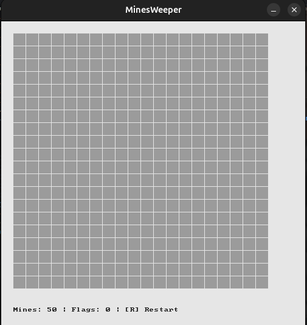
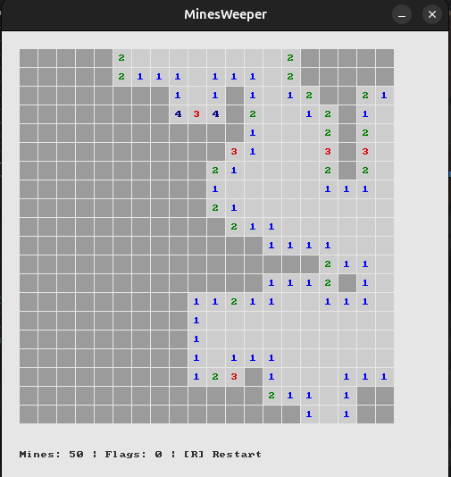
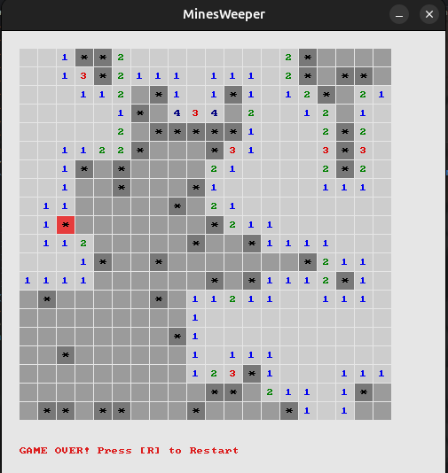

# Minesweeper (SDL3 Implementation)

A classic implementation of the Minesweeper game written in C, leveraging the SDL3 library for graphics and input handling. It features an interactive grid with a recursive reveal algorithm, flag placement, visual feedback for win and loss states, and a real-time status display.

---

## Gameplay Screenshots

The following images demonstrate the game states from initialization to completion:

| Game Start | In-Game | Loss State (Mines Revealed) |
|:---:|:---:|:---:|
|  |  |  |

---

## Features

- **Recursive Reveal Algorithm**: Empty cells automatically reveal adjacent non-mine areas recursively.
- **Classic Visual Style**: Numbered cells are color-coded in accordance with traditional Minesweeper guidelines.
- **Flag Management**: Right-click to place or remove flags on potential mine locations.
- **Active Status Bar**: Displays remaining mines, placed flags, and final game results.
- **Performance Optimization**: The application loop is capped at 60 FPS to minimize CPU overhead.
- **Instant Restart**: Press the `R` key to reset the board instantly with a new random configuration.

---

## Controls

| Input | Action |
| :--- | :--- |
| **Left Click** | Reveal a cell |
| **Right Click** | Toggle flag (`F`) |
| **R Key** | Restart the game |

---

## Build and Execution

### Prerequisites
Make sure the SDL3 library is installed on your system.

### Compiling
Compile the application by linking the SDL3 base library and the SDL3 test module, which provides the font rendering utilities:

```bash
gcc minesweeper.c -o minesweeper-lSDL3 -lSDL3_test
```

### Running
Execute the compiled binary from the project root:

```bash
./minesweeper
```
